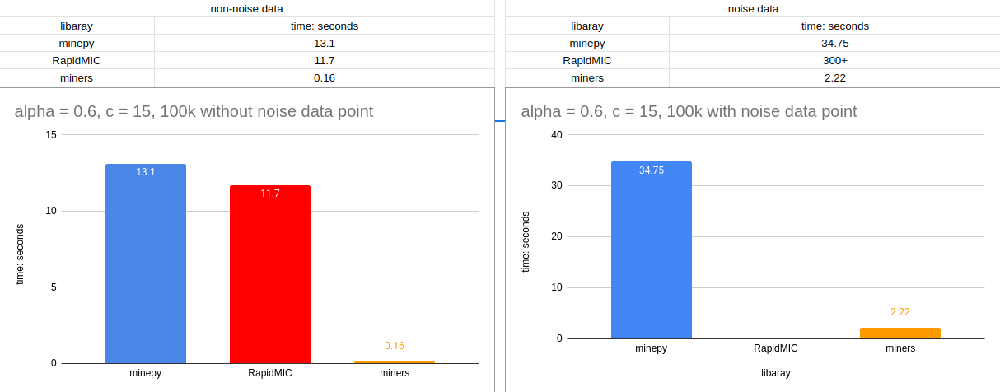

# miners

miners is a fast Rust library for the Maximal Information-based Nonparametric Exploration (MIC and MINE family). miners using rayon and vectorization to speed up the calculation of MIC, it is 10x faster than the original minepy implementation.


Yep, RapidMIC has a problem dealing with noisy high amounts of data

## Features

- APPROX-MIC(WIP) (the original algorithm, DOI: 10.1126/science.1205438) and MIC_e (DOI: arXiv:1505.02213 and DOI: arXiv:1505.02214) estimators;
- Total Information Coefficient (TIC, DOI: arXiv:1505.02213) and the Generalized Mean Information Coefficient (GMIC, DOI: arXiv:1308.5712);
- A Rust library
- an efficient Python API (WIP)
- more optimization (WIP)

## Installation

To use miners in your Rust project, add it as a dependency in your Cargo.toml file:

```toml
[dependencies]
miners = { git = "https://github.com/0xCuteSocks/miners.git" }
```

## Usage

To use miners, you need to import the `miners` crate and use the `Mine` struct to compute the statistics. For example:

```rust
use miners::*;
use rand::{thread_rng, Rng};
use std::f64::consts::PI;
use std::time::Instant;

fn print_stats(score: &MineScore) {
    println!("MIC_e: {}", mine_mic(score));
    println!("MAS: {}", mine_mas(score));
    println!("MEV: {}", mine_mev(score));
    println!("MCN (eps=0): {}", mine_mcn(score, 0.0));
    println!("MCN (eps=1-MIC): {}", mine_mcn_general(score));
    println!("TIC: {}", mine_tic(score, false));
}

fn main() {
    let x = (0..100000).map(|i| i as f64).collect::<Vec<f64>>();
    let mut y = x
        .iter()
        .map(|&x| (10.0 * PI * x).sin() + x)
        .collect::<Vec<f64>>();
    let mut rng = thread_rng();
    y.iter_mut().for_each(|y| *y += rng.gen_range(0.0..50000.0)); // add some noise

    println!("x len {:?}, y len {:?}", x.len(), y.len());

    let param = MineParameter {
        alpha: 0.6,
        c: 15.0,
    };

    let prob = MineProblem::new(x, y, &param).unwrap();
    let now = Instant::now();
    let computed_score =
        mine_compute_score(&prob.clone(), &param.clone()).expect("Failed to compute MineScore");

    println!("time cost: {:?}", now.elapsed());
    // Access the computed score's attributes if needed
    println!("Computed Score (n): {}", computed_score.n);
    println!("Computed Score (m): {:?}", computed_score.m);
    println!("Computed Score (M): {:?}", computed_score.mat);
    println!("With noise:\n");
    print_stats(&computed_score);
}

```

## Documentation

WIP

## License

miners is licensed under the GNU General Public License v3.0. See [](https://www.gnu.org/licenses/gpl-3.0) for more details.

## References

- Davide Albanese, Michele Filosi, Roberto Visintainer, Samantha Riccadonna, Giuseppe Jurman and Cesare Furlanello.
minerva and minepy: a C engine for the MINE suite and its R, Python and MATLAB wrappers. Bioinformatics (2013) 29(3): 407-408 first published online December 14, 2012 doi:10.1093/bioinformatics/bts707.
- RapidMic is a simple, easy-to-use, rapid for computing Maximal Information-based Nonparametric Exploration(D. Reshef, Y. Reshef, H. Finucane, S. Grossman, G. McVean, P. Turnbaugh, E. Lander, M. Mitzenmacher, and P. Sabeti. Detecting novel associations in large datasets. Science, 6062(334):1518-1524, 2011.)

- (1) GitHub - minepy/minepy: minepy - Maximal Information-based Nonparametric Exploration .... https://github.com/minepy/minepy.

- (2) GitHub - RapidMic is a simple, easy-to-use, rapid for computing Maximal Information-based Nonparametric Exploration .... https://github.com/HelloWorldCN/RapidMic.
